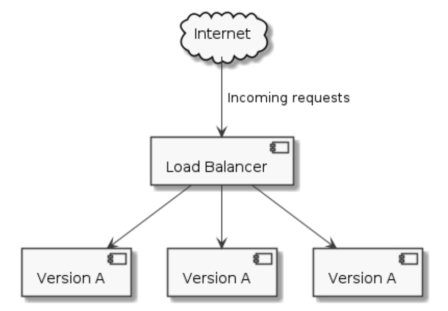
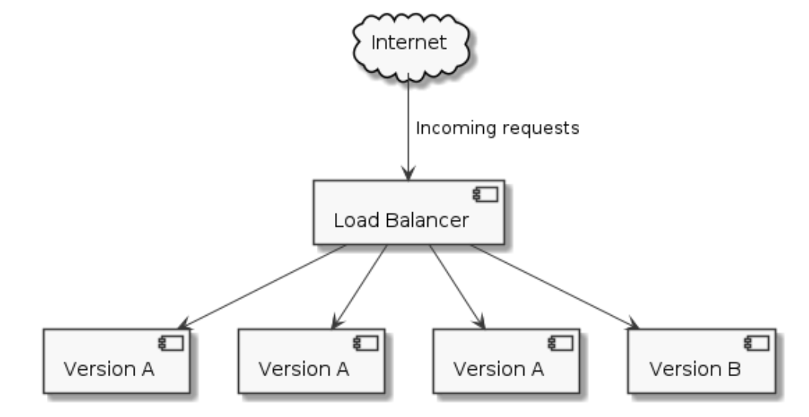
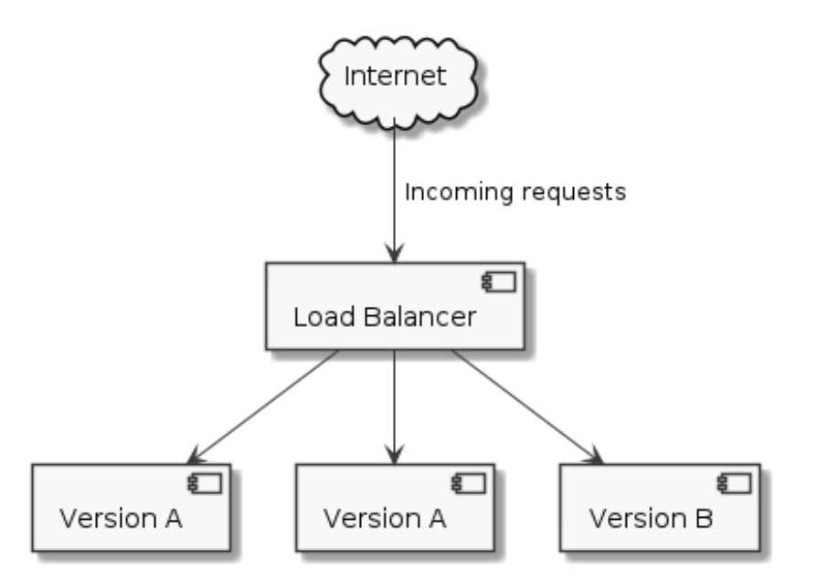

[](https://codecov.io/gh/tallamjr/zero2prod)

# Zero to Production Notes

<!-- mtoc-start -->

* [Chapter 1: Getting Started](#chapter-1-getting-started)
* [Chapter 2: Building An Email Newsletter](#chapter-2-building-an-email-newsletter)
* [Chapter 3: Sign Up A New Subscriber](#chapter-3-sign-up-a-new-subscriber)
* [Chapter 4: Telemetry](#chapter-4-telemetry)
* [Chapter 5: Going Live](#chapter-5-going-live)
* [Chapter 6: Reject Invalid Subscribers \#1](#chapter-6-reject-invalid-subscribers-1)
* [Chapter 7: Reject Invalid Subscribers \#2](#chapter-7-reject-invalid-subscribers-2)
* [Chapter 8: Error Handling](#chapter-8-error-handling)
* [Chapter 9: Naive Newsletter Delivery](#chapter-9-naive-newsletter-delivery)
* [Chapter 10: Securing Our API](#chapter-10-securing-our-api)
* [Chapter 11: Fault-tolerant Workflows](#chapter-11-fault-tolerant-workflows)

<!-- mtoc-end -->

## Chapter 1: Getting Started

### Install/update rustup:

```console
$ curl https://sh.rustup.rs -sSf | sh -s -- -y && source "$HOME/.cargo/env"
```

### CI, Formatting, etc.

```console
$ cargo llvm-cov
$ cargo fmt -- --check
$ cargo install cargo-audit
```

Fail the linter check if clippy emits any warnings

```console
$ cargo clippy -- -D warnings
```

```console
$ cargo watch -x check -x test -x run
```

### Toolchain

Install linker for macOS:

```console
$ brew install keith/formulae/ld64.lld
```

[mold/sold linker](https://github.com/rui314/mold) might be worth considering. Unsure of licesne situation and
usage considering updates with Xcode 15 that has a more improved linker now.

> We are considering relicensing the sold linker as free software rather than as
> a commercial product, given the recent developments with the official Apple
> linker. Since Apple's linker has gained speed, it's difficult to obtain a
> sufficient number of users to sustain this project.

With the confusing state of play with license I would opt for using mold only for
linux builds and ld64.lld for macOS builds.

Having said that, with the latest release of Xcode 15 on macOS, there is talk
that the new default `ld` linker is much faster for `Mach-O` targets (note,
`ld-prime` was the initial name for the new linker in Xcode 15 beta, but that
has now changed to be just `ld` and the _old_ version being called `ld-classic`.

#### Refs:

- [Trialling the Xcode 15 beta linker](https://www.reddit.com/r/rust/comments/141z6fs/trialling_the_xcode_15_beta_linker/)
- [`zld` is now archived, consider using lld instead](https://github.com/michaeleisel/zld#note-zld-is-now-archived-consider-using-lld-instead-more-info-is-here)
- [Michael Eisel's Blog aka Mr `zld`](https://eisel.me/lld)

See `.cargo/config.toml`:

```toml
# On Windows
# cargo install -f cargo-binutils
# rustup component add llvm-tools-preview
[target.x86_64-pc-windows-msvc]
rustflags = ["-C", "link-arg=-fuse-ld=lld"]

[target.x86_64-pc-windows-gnu]
rustflags = ["-C", "link-arg=-fuse-ld=lld"]

# On Linux:
# - Ubuntu, sudo apt-get install lld clang
# - Arch, sudo pacman -S lld clang
[target.x86_64-unknown-linux-gnu]
rustflags = ["-C", "linker=clang", "-C", "link-arg=-fuse-ld=lld"]

# On MacOS, brew install llvm and follow steps in brew info llvm
[target.x86_64-apple-darwin]
rustflags = ["-C", "link-arg=-fuse-ld=lld"]

[target.aarch64-apple-darwin]
# rustflags = ["-C", "link-arg=-fuse-ld=/opt/homebrew/opt/llvm/bin/ld64.lld"]

# If xcodebuild --version > 15; then use the following
rustflags = ["-C", "link-arg=-fuse-ld=/Applications/Xcode.app/Contents/Developer/Toolchains/XcodeDefault.xctoolchain/usr/bin/ld"]
```

_Anyways_ ..

1. Toolchain, installed. ✅
2. Project skeleton, done. ✅
3. IDE, ready ✅

## Chapter 2: Building An Email Newsletter

User Stories:

      - As a blog visitor,
      - I want to subscribe to the newsletter,
      - So that I can receive email updates when new content is published on the blog;

      - As the blog author,
      - I want to send an email to all my subscribers,
      - So that I can notify them when new content is published.

## Chapter 3: Sign Up A New Subscriber

1. Choose a web framework and get familiar with it;
2. Define our testing strategy;
3. Choose a crate to interact with our database (we will have to save those emails somewhere!);
4. Define how we want to manage changes to our database schemas over time (a.k.a. migrations);
5. Actually write some queries

```console
$ curl http://127.0.0.1:8000
Hello World!

```

`cargo expand` for expanding procedural macros, typicall requires `+nightly`
toolchain: can then run via `cargo +nightly expand` (and is installed via `cargo
install cargo-expand`)

```rust
warning: unused variable: `req`
 --> src/main.rs:8:23
  |
8 | async fn health_check(req: HttpRequest) -> impl Responder {
  |                       ^^^ help: if this is intentional, prefix it with an underscore: `_req`
  |
  = note: `#[warn(unused_variables)]` on by default

warning: `zero2prod` (bin "zero2prod") generated 1 warning
    Finished `dev` profile [unoptimized + debuginfo] target(s) in 0.37s

```

```toml
[lib]
# We could use any path here, but we are following the community convention # We could specify a library name using the `name` field. If unspecified,
# cargo will default to `package.name`, which is what we want.
path = "src/lib.rs"

# Notice the double square brackets: it's an array in TOML's syntax.
# We can only have one library in a project, but we can have multiple binaries!
# If you want to manage multiple libraries in the same repository
# have a look at the workspace feature - we'll cover it later on.
[[bin]]
path = "src/main.rs"
name = "zero2prod"

```

```rust
// We need to mark `run` as public.
// It is no longer a binary entrypoint, therefore we can mark it as async
// without having to use any proc-macro incantation.
pub async fn run() -> Result<(), std::io::Error> {
    HttpServer::new(|| App::new().route("/health_check", web::get().to(health_check)))
        .bind("127.0.0.1:8000")?
        .run()
        .await
}
```

> `tokio::test` is the testing equivalent of `tokio::main`.
> It also spares you from having to specify the `#[test]` attribute.

Port 0 is special-cased at the OS level: trying to bind port 0 will trigger an OS scan for an available port which
will then be bound to the application

```rust

    let server = zero2prod::run("127.0.0.1:0").expect("Failed to bind address");

```

#### Refocus

1. How to read data collected in a HTML form in actix-web (i.e. how do I parse the request body of a POST?);
2. What libraries are available to work with a PostgreSQL database in Rust (diesel vs sqlx vs tokio­postgres);
3. How to setup and manage migrations for our database;
4. How to get our hands on a database connection in our API request handlers;
5. How to test for side-effects (a.k.a. stored data) in our integration tests;
6. How to avoid weird interactions between tests when working with a database.

#### Summary

We covered a large number of topics in this chapter:

- actix-web extractors and HTML forms
- (de)serialisation with `serde`
- overview of the available database crates in the Rust ecosystem:
- fundamentals of `sqlx`

```console
$ brew install postgresql

$ cargo install --version="~0.8" sqlx-cli --no-default-features --features rustls,postgres

$ sqlx --help
Command-line utility for SQLx, the Rust SQL toolkit.

Usage: sqlx <COMMAND>

Commands:
  database  Group of commands for creating and dropping your database
  prepare   Generate query metadata to support offline compile-time verification
  migrate   Group of commands for creating and running migrations
  help      Print this message or the help of the given subcommand(s)

Options:
  -h, --help     Print help
  -V, --version  Print version

$ sqlx database -h
Group of commands for creating and dropping your database

Usage: sqlx database <COMMAND>

Commands:
  create  Creates the database specified in your DATABASE_URL
  drop    Drops the database specified in your DATABASE_URL
  reset   Drops the database specified in your DATABASE_URL, re-creates it, and runs any pending migrations
  setup   Creates the database specified in your DATABASE_URL and runs any pending migrations
  help    Print this message or the help of the given subcommand(s)

Options:
  -h, --help  Print help

$ sqlx database create

```

##### 🔑 Key Section

**3.10.1 Test Isolation**

Your database is a gigantic global variable: all your tests are interacting with
it and whatever they leave behind will be available to other tests in the suite
as well as to the following test runs. This is precisely what happened to us a
moment ago: our first test run commanded our application to register a new
subscriber with `ursula_le_guin@gmail.com` as their email; the application
obliged. When we re-ran our test suite we tried again to perform another
`INSERT` using the same email, but our `UNIQUE` constraint on the email column
raised a unique `key violation` and rejected the query,forcing the application
to return us a `500 INTERNAL_SERVER_ERROR`.

You really do not want to have _any_ kind of interaction
between your tests: it makes your test runs nondeterministic and it leads down
the line to spurious test failures that are extremely tricky to hunt down and
fix.

There are two techniques I am aware of to ensure test isolation when
interacting with a relational database in a test:

1. wrap the whole test in a SQL transaction and rollback at the end of it
2. spin up a brand-new logical database for each integration test.

The first is clever and will generally be faster: rolling back a SQL transaction
takes less time than spinning up a new logical database. It works quite well
when writing unit tests for your queries but it is tricky to pull off in an
integration test like ours: our application will borrow a PgConnection from a
PgPool and we have no way to “capture” that connection in a SQL transaction
context. Which leads us to the second option: potentially slower, yet much
easier to implement.

How? Before each test run, we want to:

1. create a new logical database with a unique name;
2. run database migrations on it.

The best place to do this is spawn_app, before launching our actix-web test
application (see. `tests/health_check.rs`)

`configuration.database.connection_string()` uses the database_name specified in
our configura­tion.yaml file - the same for all tests. Let’s randomise it with
`uuid`.

`cargo test` will fail: there is no database ready to accept connections using
the name we generated. We need to create it! In order to issue a `CREATE
DATABASE` command we need to connect to the Postgres instance, which implies
connecting to a database that already exists. We’ll use the postgres database
for this purpose, the one that comes by default with a Postgres installation.
It’s often referred to as the “maintenance database” for this reason

`sqlx::migrate!` is the same macro used by `sqlx-cli` when executing `sqlx
migrate run` - no need to throw bash scripts into the mix to achieve the same
result

You might have noticed that we do not perform any clean-up step at the end of
our tests - the logical databases we create are not being deleted. This is
intentional: we could add a clean-up step, but our Postgres instance is used
only for test purposes and it’s easy enough to restart it if, after hundreds of
test runs, performance starts to suffer due to the number of lingering (almost
empty) databases.

## Chapter 4: Telemetry

> **Observability** is about being able to ask arbitrary questions about your
> environment without — and this is the key part — having to know ahead of time
> what you wanted to ask.

- `tracing`:

> tracing expands upon logging-style diagnostics by allowing libraries and
> applications to record structured events with additional information about
> temporality and causality — unlike a log message, a span in tracing has a
> beginning and end time, may be entered and exited by the flow of execu- tion,
> and may exist within a nested tree of similar spans.

##### Key Topics

1. Facade Pattern
2. Structured Logging

_Lifetime of the span_

• We enter the span(->);
• We execute the INSERT query;
• We exit the span (<-);
• We finally close the span (--).

**Removing Unused Dependencies**: `cargo install cargo-udeps`, `cargo +nightly
udeps`

**Protect Your Secrets**: `secrecy`

```toml
# [...]
[dependencies]
secrecy = { version = "0.8", features = ["serde"] }
# [...]
```

## Chapter 5: Going Live

> “Get customer feedback early!”
> “Ship often and iterate on the product!”

**Leveraging CI and Docker**

> A Dockerfile is a recipe for your application environment.
> They are organised in layers: you start from a base image (usually an OS
> enriched with a programming language toolchain) and execute a series of commands
> (COPY, RUN, etc.), one after the other, to build the environment you need.

```bash
# We use the latest Rust stable release as base image
FROM rust:1.80.1
# Let's switch our working directory to `app` (equivalent to `cd app`)
# The `app` folder will be created for us by Docker in case it does not
# exist already.
WORKDIR /app
# Install the required system dependencies for our linking configuration RUN apt
update && apt install lld clang -y
# Copy all files from our working environment to our Docker image
COPY . .
# Let's build our binary!
# We'll use the release profile to make it faaaast
RUN cargo build --release
# When `docker run` is executed, launch the binary!
ENTRYPOINT ["./target/release/zero2prod"]
```

```console
# Build a docker image tagged as "zero2prod" according to the recipe
# specified in `Dockerfile`
docker build --tag zero2prod .
```

_Use the offline mode for `sqlx`._

```console
# We use `--all-targets` to include the queries
# defined in our integration tests
cargo sqlx prepare --workspace -- --all-targets

query data written to `.sqlx` in the workspace root;
please check this into version control
```

```bash
...
ENV SQLX_OFFLINE true
...
```

**Optimising Our Docker Image**

There are two optimisations we can make to our Dockerfile to make our life
easier going forward:

- Smaller image size for faster usage;
- Docker layer caching for faster builds.

We can use the bare operating system as base image (`debian:bookworm-slim`) for
our runtime stage:

```bash

# [...]

# Runtime stage

FROM debian:bookworm-slim AS runtime
WORKDIR /app

# Install OpenSSL - it is dynamically linked by some of our dependencies
# Install ca-certificates - it is needed to verify TLS certificates
# when establishing HTTPS connections
RUN apt-get update -y \
  && apt-get install -y --no-install-recommends openssl ca-certificates \
  # Clean up
  && apt-get autoremove -y \
  && apt-get clean -y \
  && rm -rf /var/lib/apt/lists/\*
COPY --from=builder /app/target/release/zero2prod zero2prod
COPY configuration configuration
ENV APP_ENVIRONMENT production
ENTRYPOINT ["./zero2prod"]
```

We could go even smaller by using rust:1.80.1-alpine, but we would have to
cross-compile to the linux-musl target - out of scope for now. Check out
[rust-musl-builder](https://github.com/clux/muslrust) if you are interested in
generating tiny Docker images. Another option to reduce the size of our binary
further is stripping symbols from it - you can find more information about it
[here](https://doc.rust-lang.org/cargo/reference/profiles.html#strip)

> rustc statically links all Rust code but dynamically links libc from the
> underlying system if you are using the Rust standard library. You can get a
> fully statically linked binary by targeting linux-musl; check out Rust’s
> supported platforms and targets for more information.

Rust’s binaries are statically linked - we do not need to keep the source code
or intermediate compilation artefacts around to run the binary, it is entirely
self-contained.

This plays nicely with multi-stage builds, a useful Docker feature. We can split
our build in two stages:

- A builder stage, to generate a compiled binary;
- A runtime stage, to run the binary.

You can think of each stage as its own Docker image with its own caching - they
only interact with each other when using the `COPY --from` statement.

```bash

#! spec.yaml
name: zero2prod
# Check https://www.digitalocean.com/docs/app-platform/#regional-availability # for a list of all the available options.
# You can get region slugs from
# https://www.digitalocean.com/docs/platform/availability-matrix/
# They must specified lowercased.
# `fra` stands for Frankfurt (Germany - EU)
region: fra
services:
  - name: zero2prod
  # Relative to the repository root
  dockerfile_path: Dockerfile
  source_dir: .
  github:
    # Depending on when you created the repository,
    # the default branch on GitHub might have been named `master`
    branch: main
    # Deploy a new version on every commit to `main`!
    # Continuous Deployment, here we come!
    deploy_on_push: true
    # !!! Fill in with your details
    # e.g. LukeMathWalker/zero-to-production
    repo: <YOUR USERNAME>/<YOUR REPOSITORY NAME>
  # Active probe used by DigitalOcean's to ensure our application is healthy
  health_check:
    # The path to our health check endpoint!
    # It turned out to be useful in the end!
    http_path: /health_check
  # The port the application will be listening on for incoming requests
  # It should match what we specified in our configuration/production.yaml file!
  http_port: 8000
  # For production workloads we'd go for at least two!
  # But let's try to keep the bill under control for now...
  instance_count: 1
  instance_size_slug: basic-xxs
  # All incoming requests should be routed to our app
  routes:
    - path: /
```

```console
doctl apps create --spec spec.yaml

doctl apps list
```

Potential OOM error on Digital Ocean: https://github.com/LukeMathWalker/zero-to-production/issues/71

```console
# You can retrieve your app id using `doctl apps list`
doctl apps update YOUR-APP-ID --spec=spec.yaml
```

```console
curl --request POST \
    --data 'name=le%20guin&email=ursula_le_guin%40gmail.com' \
    https://zero2prod-adqrw.ondigitalocean.app/subscriptions \
    --verbose
```

## Chapter 6: Reject Invalid Subscribers \#1

#### 6.5 Ownership Meets Invariants

Given a field in a struct we can choose to:

- Expose it by value, consuming the struct itself

```rust
impl SubscriberName {
  pub fn inner(self) -> String {
    // The caller gets the inner string,
    // but they do not have a SubscriberName anymore!
    // That's because `inner` takes `self` by value,
    // consuming it according to move semantics
    self.0
  }
}
```

- Expose a mutable reference:

```rust
impl SubscriberName {
  pub fn inner_mut(&mut self) -> &mut str {
    // The caller gets a mutable reference to the inner string.
    // This allows them to perform *arbitrary* changes to
    // value itself, potentially breaking our invariants!
    &mut self.0
  }
}
```

- Expose a shared reference:

```rust
impl SubscriberName {
  pub fn inner_ref(&self) -> &str {
    // The caller gets a shared reference to the inner string.
    // This gives the caller **read-only** access,
    // they have no way to compromise our invariants!
    &self.0
  }
}
```

`inner_mut` is not what we are looking for here - the loss of control on our
invariants would be equivalent to using `SubscriberName(pub String)`. Both
`inner` and `inner_ref` would be suitable, but `inner_ref` communicates better
our intent: give the caller a chance to read the value without the power to
mutate it.

While our inner_ref method gets the job done, I am obliged to point out that
Rust’s standard library ex-poses a trait that is designed exactly for this type
of usage - `AsRef`.

**`AsRef`**:

```rust
pub trait AsRef<T: ?Sized> {
  /// Performs the conversion. fn as_ref(&self) -> &T;
}
```

...

```rust
//! src/domain.rs
// [...]
impl AsRef<str> for SubscriberName {
  fn as_ref(&self) -> &str {
    &self.0
  }
}
```

#### 6.6 Panics

> [...] If your Rust application panics in response to any user input, then the
> following should be true:
> your application has a bug, whether it be in a library or in the primary
> application code.

#### 6.7 `Result`

```rust
pub enum Result<T, E> {
  Ok(T),
  Err(E),
}
```

Type conversion

```rust
pub trait TryFrom<T>: Sized {
  /// The type returned in the event of a conversion error. type Error;
  /// Performs the conversion.
  fn try_from(value: T) -> Result<Self, Self::Error>; }

pub trait TryInto<T> { type Error;
  fn try_into(self) -> Result<T, Self::Error>; }
```

<!-- TODO: TODAY -->

## Chapter 7: Reject Invalid Subscribers \#2

The Implementation Strategy

1. Write a module to send an email;
2. Adapt the logic of our existing `POST /subscriptions` request handler to match the new specification;
3. Write a `GET /subscriptions/confirm` request handler from scratch.

`reqwest`

HTTP Mocking With `wiremock`

`wiremock::MockServer` is a full-blown HTTP server.

`MockServer::start` asks the operating system for a random available port and
spins up the server on a back- ground thread, ready to listen for incoming
requests.

> What does `.expect(1)` do?
> It sets an _expectation_ on our mock: we are telling the mock server that during
> this test it should receive exactly one request that matches the conditions
> set by this mock.
>
> We could also use ranges for our expectations - e.g. `expect(1..)` if we want to
> see at least one request, `expect(1..=3)` if we expect at least one request but no
> more than three, etc.
>
> Expectations are verified when `MockServer` goes out of scope - at the end of our
> test function, indeed! Before shutting down, `MockServer` will iterate over all
> the mounted mocks and check if their expectations have been verified. If the
> verification step fails, it will trigger a panic (and fail the test).

```console
$ curl "https://api.postmarkapp.com/email" \
  -X POST \
  -H "Accept: application/json" \
  -H "Content-Type: application/json" \
  -H "X-Postmark-Server-Token: server token" \
  -d '{
  "From": "sender@example.com",
  "To": "receiver@example.com",
  "Subject": "Postmark test",
  "TextBody": "Hello dear Postmark user.",
  "HtmlBody": "<html><body><strong>Hello</strong> dear Postmark user.</body></html>"
}'

```

- A `POST` request to the `/email` endpoint;
- A `JSON` body, with fields that map closely to the arguments of send_email. We
  need to be careful with field names, they must be pascal cased;
- An authorization header, `X-Postmark-Server-Token`, with a value set to a secret
  token that we can retrieve from their portal.

If the request succeeds, we get something like this back:

```console
HTTP/1.1 200 OK
Content-Type: application/json
{
    "To": "receiver@example.com",
    "SubmittedAt": "2021-01-12T07:25:01.4178645-05:00",
    "MessageID": "0a129aee-e1cd-480d-b08d-4f48548ff48d",
    "ErrorCode": 0,
    "Message": "OK"
}
```

`reqwest::Client::post`:
`reqwest::Client` exposes a post method - it takes the URL we want to call with a
POST request as argument and it returns a `RequestBuilder`.

**Test code is still code.**

#### A Reminder of the Strategy

**`POST /subscriptions` will:**

- Add the subscriber details to the database in the subscriptions table, with
  status equal to pending_confirmation;
- Generate a (unique) `subscription_token`;
- Store `subscription_token` in our database against the subscriber id in a
  subscription_tokens table;
- Send an email to the new subscriber containing a link structured as
  `https://<api-domain>/subscriptions/confirm?token=<subscription_token>`;
- Rreturn a `200 OK`.

**Once they click on the link, a browser tab will open up and a `GET` request will
be fired to our `GET /subscriptions/confirm` endpoint. The request handler
will:**

- Retrieve `subscription_token` from the query parameters;
- Retrieve the subscriber id associated with `subscription_token` from the
  `subscription_tokens` table;
- Update the subscriber status from `pending_confirmation` to active in the
  subscriptions table;
- Return a `200 OK`.

#### Zero Downtime: Rolling Update Deployments

> This deployment strategy is called rolling update: we run the old and the new
> version of the application side by side, serving live traffic with both.
> Throughout the process we always have three or more healthy backends: users
> should not experience any kind of service degradation (assuming version B is not
> buggy).





**State Is Kept Outside The Application**

Load balancing relies on a strong assumption: no matter which backend is used to
serve an incoming request, the outcome will be the same.

This is something we discussed already in Chapter 3: to ensure high availability
in a fault-prone environ- ment, cloud-native applications are stateless - they
delegate all persistence concerns to external systems (i.e. databases).

That’s why load balancing works: all backends are talking to the same database
to query and manipulate the same state.

Think of a database as a single gigantic global variable. Continuously accessed
and mutated by all replicas of our application.

**Transactions In Sqlx**

> Relational databases (and a few others) provide a mechanism to mitigate this
> issue: **transactions.**

```rust
//! src/routes/subscriptions.rs
use sqlx::{Postgres, Transaction, Executor};
// [...]
```

`Transaction` exposes two dedicated methods: `Transaction::commit`, to persist
changes, and `Transaction::rollback`, to abort the whole operation.

## Chapter 8: Error Handling

<!-- TODO: MONDAY -->

> What does a good error look like? Who are errors for? Should we use a library?
> Which one?

## Chapter 9: Naive Newsletter Delivery

## Chapter 10: Securing Our API

<!-- TODO: TUESDAY -->
<!-- Revisit code, review this document -->
<!-- Deploy, go live. Refactor, etc. -->

## Chapter 11: Fault-tolerant Workflows

<!-- TODO: WEDNESDAY -->
<!-- EuroRust Workshop -->

<!-- TODO: THURSDAY/FRIDAY -->
<!-- Wrap up. Review book code. Final notes. -->

<!-- NOTE: w/c 14th Oct. -->
<!-- Continue with CC Rust Track -->
<!-- 1hr. 15 per-day. 1hr coding, 15min wrap up -->
